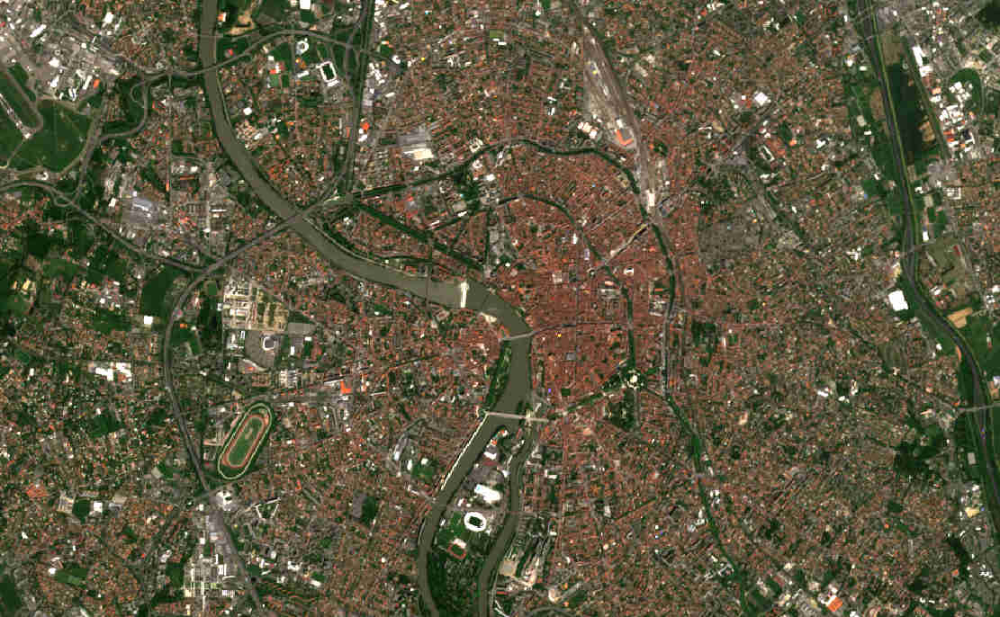
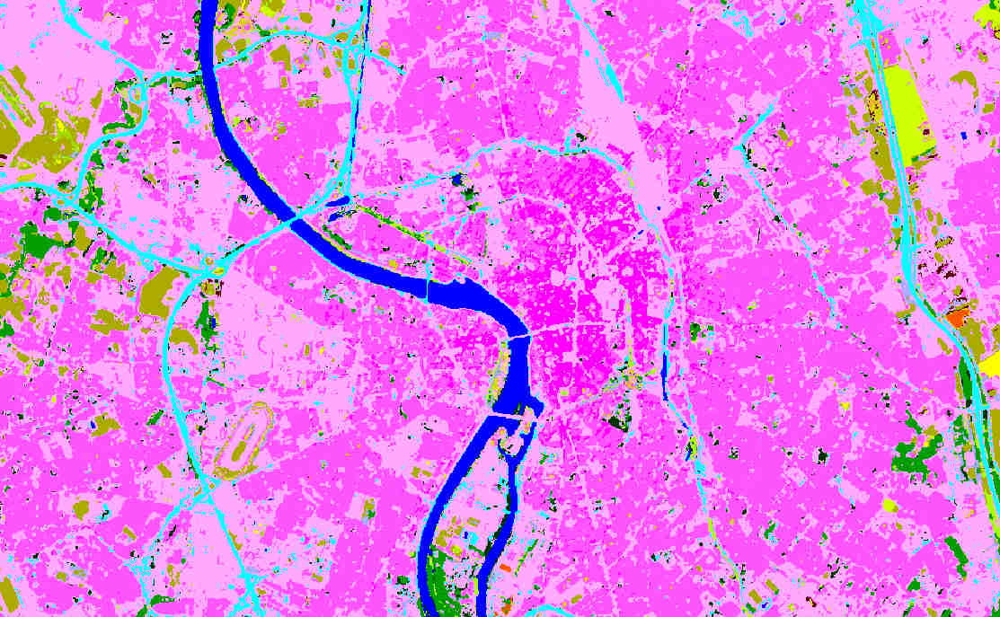
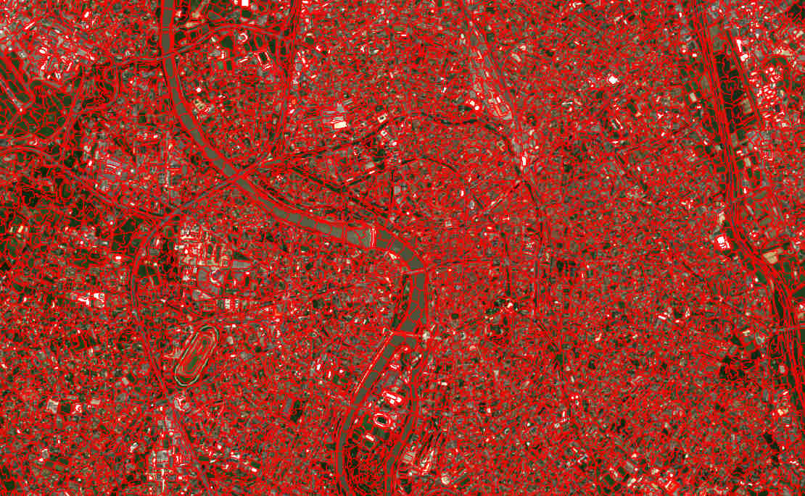
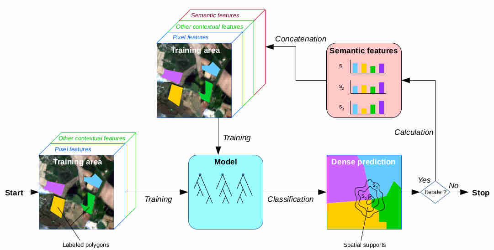

Auto-context
============

First, a summary of auto-content workflow will be exposed. Then, we will see 
how to activate it in the iota² configuration file, 
to finish with a tutorial showing inputs and outputs related to it.

.. Note::

    Full explanations about auto-context algorithm's internal choices could be found at [1]_.
    Which is the original auto-context implementation, scaled-up in iota². Also,
    some explanations presented in this documentation are directly extracted from the article 
    previously cited.

About auto-context
------------------

In context-dependent areas, there is not sufficient information in the pixel features to confidently
infer the class label. These areas are characterized by the presence of
contextual dependencies between the target pixel and the pixels in its neighborhood.
For instance, industrial areas must have road networks and parking lots
connecting them, to allow access for workers and clients. In many cases, beaches and dunes are
situated near water bodies. These relations are challenging to model, as they can sometimes represent
long-range dependencies. Therefore, they require using an extended spatial support covering a variety
of different objects which can be difficult to describe with few features.

Contextual classifications could be summarized by the ability of learning the
local_ description_ of the classes_ around the pixel of interest.

For instance, considering a classification of the city of Toulouse (FRANCE) with
the targeted classes : Continuous Urban Fabric, Discontinuous Urban Fabric, non urban classes...

    
    city of Toulouse

We can intuitively infer that :abbr:`CUF (Continuous Urban Fabric)` will be concentrated in the center of map
and the further away from the city center you go the more you get :abbr:`DUF (Discontinuous Urban Fabric)` 
because urban area is less and less dense. The pupose of the auto-context workflow is to transform
this visual interpretation into a classification algorithm. To achieve this purpose, a dense classification 
must be done : helping us to describe the scene around the pixel of interest. Then the notion of "around the pixel"
will be developped to finish with scene descriptor used to learn a classification model.

.. _classes:

Produce a dense classification
******************************

By the use of supervised classifications method, a dense classification is generated.

    
    city of Toulouse, classified
    
.. _local:
.. _segments:

Pixel neighborhood
******************

A scene segmentation has to be done in order to bound target pixel neighborhood.
Autors [1]_ highly suggest the use of superpixels segmentation method. Indeed, the
algorithm used to produce the segmentation, known as Simple Linear Iterative Clustering,
or SLIC, aims to provide segments that exhibit homogeneous features, but are also
similar in size, and have a relatively compact shape.

    
    city of Toulouse, segmented

.. _description:

AutoContext descriptors
***********************

The autors_ proposal is to use the histogram of classes_ into the superpixels
segments_ as new features to learn models.

+--------------------------------------------------+--------------------------------------------------+
| .. figure:: ./Images/superpixel_segment.jpg      | .. figure:: ./Images/autoContextHistograms.jpg   |
|   :alt: superpixel segment and classifcation     |   :alt: histrogram feature                       |
|   :scale: 50 %                                   |   :scale: 50 %                                   |
|   :align: center                                 |   :align: center                                 |
|                                                  |                                                  |
|   superpixel segment and classifcation           |   histrogram feature                             |
+--------------------------------------------------+--------------------------------------------------+

Once every histograms are calculed over the whole segments, a new model can be 
learnt, taking into acount these contextual features. Theses processes could be repeated 
in order to learn better contextual features. The general workflow algorithm 
is shown below.

AutoContext general workflow
****************************

    
    AutoContext general workflow [1]_

.. Note::

    [2]_ compare standard pixel classification versus auto-context classifications.

How to activate auto-context processing
---------------------------------------

There is only two parameters involved in auto-context processing :

+-----------------------+------------------+--------------------------+--------------+------------------------------------------+
|Parameter Key          |Parameter section |Parameter Type            |Default value |Parameter purpose                         |
+=======================+==================+==========================+==============+==========================================+
|enable_autoContext     |chain             |Boolean                   | False        |enable the auto-context processing        |
+-----------------------+------------------+--------------------------+--------------+------------------------------------------+
|autoContext_iterations |chain             |integer                   | 3            |number of iterations                      |
+-----------------------+------------------+--------------------------+--------------+------------------------------------------+

Example : 

.. code-block:: python
    
        chain:
        {
        ...
        enable_autoContext:True
        autoContext_iterations:3
        ...
        }

I/Os descriptions
-----------------

Here is an example of a configuration file :download:`cfg <./config/config_autoContext.cfg>` 
which enable auto-context and is suitable with the downloadable `data-set <http://osr-cesbio.ups-tlse.fr/echangeswww/TheiaOSO/IOTA2_TEST_S2.tar.bz2>`_ .

SLIC segmentation
*****************

Superpixels segmentations could be found under the name ``SLIC_T.tif`` where ``T``
is the tile's name. These raster files are located into the directory ``features/T31TCJ/tmp``

Supervised models
*****************

Every models resulting from auto-context iterations are located in the directory ``model``

Internal choices
----------------

SLIC segmentation
*****************

The spatial width described in [3]_ and directly related to the segment's size is set 
to the input remote sensing data resolution (ie : 10, if Sentinel-2 data are used).

Classifier
**********

.. Warning::

    Auto-context iteration involves multiple learning and prediction stages. Consequently, 
    ``the only usable classifer is the random forest``, only for its abitily to learn 
    a model and to predict pixels quickly.

References
----------

.. _autors:

.. [1] `Derksen, D et al. Geometry Aware Evaluation Of Handcrafted Superpixel-Based Features and Convolutional Neural Networks For Land Cover Mapping Using Satellite Imagery. <https://sciprofiles.com/publication/view/81fc5f500a01082b88539c0d255c458a>`_

.. [2] `D. Derksen, J. Inglada and J. Michel, "Spatially Precise Contextual Features Based on Superpixel Neighborhoods for Land Cover Mapping with High Resolution Satellite Image Time Series," IGARSS 2018 - 2018 IEEE International Geoscience and Remote Sensing Symposium, Valencia, 2018, pp. 200-203. <http://ieeexplore.ieee.org/stamp/stamp.jsp?tp=&arnumber=8518961&isnumber=8517275>`_

.. [3] `D. Derksen, J. Inglada and J. Michel, "Scaling Up SLIC Superpixels Using a Tile-Based Approach," in IEEE Transactions on Geoscience and Remote Sensing, vol. 57, no. 5, pp. 3073-3085, May 2019. <http://ieeexplore.ieee.org/stamp/stamp.jsp?tp=&arnumber=8606448&isnumber=8697166>`_

