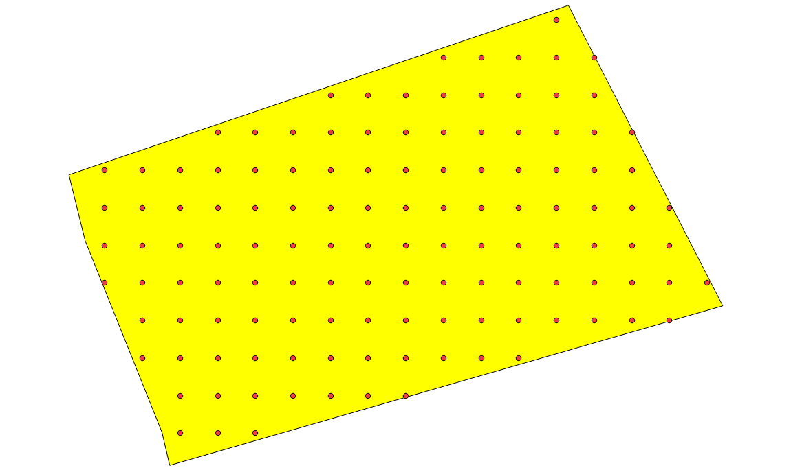
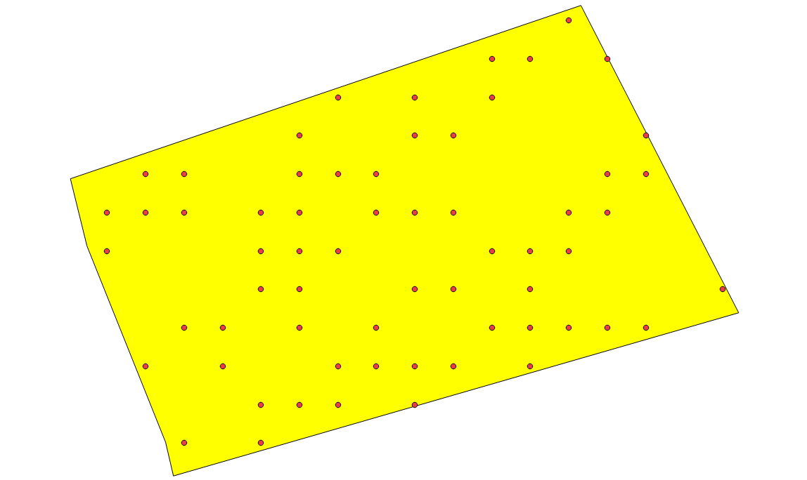
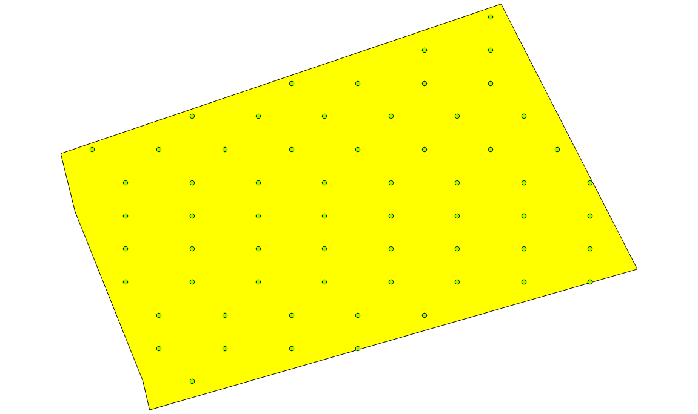

iota²'s samples management
##########################

This chapter provides explanations about how training and validation samples are managed during the iota² run. First, we will see how to give iota² inputs about the dataBase location and some restrictions on it. Next, a focus will be done on the chain' fields related to the sampling strategy. The different strategies will be illustrated through examples.

Input dataBase location and label's field
*****************************************

+-------------+--------------------------+--------------+------------------------------------------+
|Parameter Key|Parameter Type            |Default value |Parameter purpose                         |
+=============+==========================+==============+==========================================+
|groundTruth  |string                    | Mandatory    |Input dataBase                            |
+-------------+--------------------------+--------------+------------------------------------------+
|dataField    |string                    | Mandatory    |Field from the dataBase containing labels |
+-------------+--------------------------+--------------+------------------------------------------+

.. Note:: 
    In the downloadable `data-set <http://osr-cesbio.ups-tlse.fr/echangeswww/TheiaOSO/IOTA2_TEST_S2.tar.bz2>`_, 
    the dataBase file is 'groundTruth.shp' and the dataField is named 'CODE'.

Sampling strategy fields
************************

+----------------------------+--------------------------+-----------------+---------------------------------------------------------------------------------------------------------------------------+
|Parameter Key               |Parameter Type            |Default value    |Parameter purpose                                                                                                          |
+============================+==========================+=================+===========================================================================================================================+
|:ref:`ratio`                |float                     | 0.5             |Range in ]0;1[: ratio between learning samples / validation samples                                                        |
+----------------------------+--------------------------+-----------------+---------------------------------------------------------------------------------------------------------------------------+
|:ref:`splitGroundTruth`     |boolean                   | True            |Enable the split in learning and validation samples set                                                                    |
+----------------------------+--------------------------+-----------------+---------------------------------------------------------------------------------------------------------------------------+
|:ref:`runs`                 |integer                   | 1               |Number of random splits between learning samples and validation samples                                                    |
+----------------------------+--------------------------+-----------------+---------------------------------------------------------------------------------------------------------------------------+
|:ref:`cloud_threshold`      |integer                   | 1               |Threshold neeeded to pick-up learning samples. Every samples which are valid > cloud_threshold could be use to learn models|
+----------------------------+--------------------------+-----------------+---------------------------------------------------------------------------------------------------------------------------+
|:ref:`sampleSelectionTag`   |python's dictionnary      | cf Note 1       |Sampling strategy in learning polygons                                                                                     |
+----------------------------+--------------------------+-----------------+---------------------------------------------------------------------------------------------------------------------------+
|:ref:`sampleAugmentationTag`|python's dictionnary      | cf Note 2       |Generate synthetic samples                                                                                                 |
+----------------------------+--------------------------+-----------------+---------------------------------------------------------------------------------------------------------------------------+
|:ref:`sampleManagement`     |string                    | None            |Copy samples between samples-set                                                                                           |
+----------------------------+--------------------------+-----------------+---------------------------------------------------------------------------------------------------------------------------+

*Note 1* : sampleSelection default value

.. code-block:: python

    sampleSelection:
    {
        "sampler": "random",
        "strategy": "all"
    }

which means all pixels inside learning polygons will be used to build models.

*Note 2* : sampleAugmentation default value

.. code-block:: python

    sampleAugmentation:
    {
        "activate": False
    }

which means no sample augmentation will be done.

Different strategies illustrated by examples
********************************************

Every examples come with a configuration file allowing users to reproduce outputs.
These configaration files will produce iota²'s outputs in ``'/XXXX/IOTA2_TEST_S2/IOTA2_Outputs/Results'`` 
directory.

.. _splitGroundTruth:

splitGroundTruth
----------------

By default this parameter is set to ``False``. In iota²'s outputs, there is a directory named ``dataAppVal`` which contains all learning and validation polygons by tiles. After a iota² run, the dataAppVal directory
should contains two files : ``T31TCJ_seed_0_learn.sqlite`` and ``T31TCJ_seed_0_val.sqlite``.

.. Note:: files T31TCJ_seed_0_*.sqlite contain polygons for each models, here discriminate thanks to the field ``region``.

As the dataBase input was not split, the two files must contain the same number of features.
The entire dataBase is used to learn the model and to evaluate classifications. In pratice this situation should be avoided to reduce the spatial autocorrelation when computing the classification score.

See what happened when this parameter is set to ``True`` in :download:`cfg <./config/config_splitGroundTruth.cfg>`

.. _ratio:

ratio
-----

The ``ratio`` parameter allows users to tune the ratio between polygons dedicated to learn models and polygons used to evaluate 
classifications when the parameter ``splitGroundTruth`` is set to ``True`` . By launching iota² with the ratio parameter :download:`cfg <./config/config_ratio.cfg>` 
we can observe the content of files ``T31TCJ_seed_0_*.sqlite`` in the iota²'s
output directory ``dataAppVal``.

The dataBase input provided ``groundTruth.shp`` contains 26 features and 13
different class. Then by setting the ratio at ``0.5``, files ``T31TCJ_seed_0_learn.sqlite`` 
and ``T31TCJ_seed_0_val.sqlite`` will contain 13 samples each.

.. Warning:: the ratio is computed considering the number of polygons, not area.
    Then polygons belonging to a same class should almost cover the same surface. Also, 
    the ratio is processed by class and by models in order to keep the origin dataBase
    class repartition.

.. Note:: ``ratio:0.6`` mean ``60%`` of eligible polygons will be use to learn models 
    and 40% to evaluate classifications

.. _runs:

runs
----

The parameter run ``do not influence the sampling strategy``. However, sampling will be repeated in order to reduce bias during selection. When it is superior to 1, several runs with different random training/validation split are done, and the reported classification accuracy is averaged over the different runs. A confidence interval (standard deviation) for each coefficient measuring the classification's quality is then computed.

.. _cloud_threshold:

cloud_threshold
---------------

This parameter allows users to clean-up the dataBase from samples which can not be used to learn models or to evaluate classifications. The pixel validity is used to determine if samples are usable. Considering a remote acquisition, a valid pixel at time ``t`` is a pixel which is not flagged as clouds, clouds' shadow or saturated. Thus, usable samples are samples which are valid more than ``cloud_threshold`` times.

We can observe the influence of the ``cloud_threshold`` parameter by launching iota² with :download:`cfg <./config/config_cloudThreshold.cfg>`

First, here is the tree from the ``features`` iota² output directory

.. code-block:: console

    features
    └── T31TCJ
        ├── CloudThreshold_2.dbf
        ├── CloudThreshold_2.prj
        ├── CloudThreshold_2.shp
        ├── CloudThreshold_2.shx
        ├── nbView.tif
        └── tmp
            ├── MaskCommunSL.dbf
            ├── MaskCommunSL.prj
            ├── MaskCommunSL.shp
            ├── MaskCommunSL.shx
            ├── MaskCommunSL.tif
            └── Sentinel2_T31TCJ_reference.tif

Let's open nbView.tif and CloudThreshold_2.shp files.

+--------------------------------------------------+--------------------------------------------------+
| .. figure:: ./Images/PixVal_Example.png          | .. figure:: ./Images/CloudThreshold_vector.png   |
|   :alt: Pixel validity raster                    |   :alt: Cloud threshold vector                   |
|   :scale: 50 %                                   |   :scale: 45 %                                   |
|   :align: center                                 |   :align: center                                 |
|                                                  |                                                  |
|   Pixel validity raster                          |   Cloud threshold vector                         |
+--------------------------------------------------+--------------------------------------------------+

As you can notice, every pixels in the validity raster which are ``superior or equal``
to the parameter ``cloud_threshold`` value (here 2) belong to a geometry in the 
vector file CloudThreshold_2.shp. Next, available polygons are the ones resulting
from the intersection of the CloudThreshold_2.shp vector file and the dataBase input.

.. _sampleSelectionTag:

sampleSelection
---------------

Once learning polygons are chosen, it is the time to select pixels by sampling 
polygons. Many strategies are available through the use of OTB `SampleSelection <https://www.orfeo-toolbox.org/CookBook/Applications/app_SampleSelection.html>`_ 
application, this section will detail some of them.

First, we may have a look at the default strategy by using one of previous configuration
file :download:`cfg <./config/config_ratio.cfg>`. In order to 
visualize the influence of strategies, we can open the file ``T31TCJ_selection_merge.sqlite``
stored in the directory named ``samplesSelection``. Files called  ``*_selection_merge.sqlite`` 
are tiles specific and contain every points selected to learn each models and each
seeds (random splits).

    
    random sampling polygon at 100% rate

Points represent pixel's centroid selected by the strategy to learn a model. Here,
every pixels under polygons will be dedicated to learn models. This is the default 
strategy 

.. code-block:: python

    sampleSelection:
    {
        "sampler": "random",
        "strategy": "all"
    }

Sometimes, it could be interesting to change the default strategy to a more suited one (depending on the specific use-case): using High resolution remote sensor, too many polygons,
polygons too big, class repartition is unbalanced ...

Sampling randomly with a 50% rate
^^^^^^^^^^^^^^^^^^^^^^^^^^^^^^^^^

By adding the block below in the configuration file, we ask a new sampling strategy :
select randomly pixel with a 50% rate. :download:`cfg<./config/config_select50per.cfg>`

.. code-block:: python

    sampleSelection :
    {
        "sampler":"random",
        "strategy":"percent",
        "strategy.percent.p":0.5
    }

    
    random sampling polygon at 50% rate

Periodic sampling
^^^^^^^^^^^^^^^^^

By changing the sampler sampler argument from ``random`` to ``periodic`` one pixel 
every two are selected for "strategy.percent.p":0.5. If "strategy.percent.p":0.1, one pixel every ten pixel would be selected.

.. code-block:: python

    sampleSelection :
    {
        "sampler":"periodic",
        "strategy":"percent",
        "strategy.percent.p":0.5
    }

    
    periodic sampling polygon at 50% rate

Different sampling strategy by models
^^^^^^^^^^^^^^^^^^^^^^^^^^^^^^^^^^^^^

An interesting feature is the ability of iota² to set a strategy by model.
Obviously, many models must exist and mentionned in the configuration file. 
:download:`cfg<./config/config_manyStrategies.cfg>`

.. code-block:: python

    sampleSelection : {"sampler":"random",
                       "strategy":"all",
                       "per_model":[{"target_model":2,
                                     "sampler":"random",
                                     "strategy":"percent",
                                     "strategy.percent.p":0.5
                                     }]
                       }

The aim of this strategy is to sample every polygons with a rate of 
100% except polygons belonging to the ``model 2`` which will be sampled with 
a 50% rate.

In our case, only two models are invoked, then the strategy presented is equivalent to

.. code-block:: python

    sampleSelection : {"per_model":[{"target_model":1,
                                     "sampler":"random",
                                     "strategy":"all"
                                    },
                                    {"target_model":2,
                                     "sampler":"random",
                                     "strategy":"percent",
                                     "strategy.percent.p":0.5
                                    }]
                       }

The argument ``per_model`` receive a list of python's dictionnary describing a strategy
by ``target_model``. Every keys ("sampler", "strategy") are the ones provided by 
`SampleSelection <https://www.orfeo-toolbox.org/CookBook/Applications/app_SampleSelection.html>`_ 
OTB's application except ``target_model`` which is specific to iota².

.. Note:: The strategy ``byclass`` provided by OTB could also be useful to fix 
    the number of samples selected by class and set 'manually' the balance in the
    dataBase.

.. _sampleAugmentationTag:

sampleAugmentation
------------------

Sample's augmentation is used to generate sythetic samples from a sample-set. This feature is useful to balance class in the dataBase. In order to achieve this, iota2 offer an interface to the OTB
`SampleAugmentation <https://www.orfeo-toolbox.org/CookBook/Applications/app_SampleSelection.html>`_ application.
To augment samples, users must chose between methods to perform augmentation and set how many samples must be add.

Methods
^^^^^^^

There are three methods to generate samples : replicate, jitter and smote.
The documentation :doc:`here <sampleAugmentation_explain>` explains the difference between these approaches.

Number of additional samples
^^^^^^^^^^^^^^^^^^^^^^^^^^^^

There are 3 different strategies:

    - minNumber
        To set the minimum number of samples by class required
    - balance
        Samples are generated for each class until every class reach the same number of training samples as the largest one.
    - byClass
        augment only some of the classes

Parameters related to ``minNumber`` and ``byClass`` strategies are

    - samples.strategy.minNumber
        minimum number of samples per classes.
    - samples.strategy.byClass
        path to a CSV file containing in first column the class's label and 
        in the second column the minimum number of samples required.

sampleAugmentation's parameters
^^^^^^^^^^^^^^^^^^^^^^^^^^^^^^^

+--------------------------+--------------------------+--------------+-------------------------------------------------------------------------------------------------+
|Parameter Key             |Parameter Type            |Default value |Parameter purpose                                                                                |
+==========================+==========================+==============+=================================================================================================+
|target_models             |list                      | Mandatory    |List containing string to target models to augment. target_models : ["all"] to augment all models|
+--------------------------+--------------------------+--------------+-------------------------------------------------------------------------------------------------+
|strategy                  |string                    | Mandatory    |Augmentation strategy [replicate/jitter/smote]                                                   |
+--------------------------+--------------------------+--------------+-------------------------------------------------------------------------------------------------+
|strategy.jitter.stdfactor |integer                   | 10           |Factor for dividing the standard deviation of each feature                                       |
+--------------------------+--------------------------+--------------+-------------------------------------------------------------------------------------------------+
|strategy.smote.neighbors  |string                    | Mandatory    |Number of nearest neighbors                                                                      |
+--------------------------+--------------------------+--------------+-------------------------------------------------------------------------------------------------+
|samples.strategy          |string                    | Mandatory    |Define how samples will be generated [minNumber/balance/byClass]                                 |
+--------------------------+--------------------------+--------------+-------------------------------------------------------------------------------------------------+
|samples.strategy.minNumber|integer                   | Mandatory    |Minimum number of samples                                                                        |
+--------------------------+--------------------------+--------------+-------------------------------------------------------------------------------------------------+
|samples.strategy.byClass  |string                    | Mandatory    |path to a CSV file. First column the class's label, Second column : number of samples required   |
+--------------------------+--------------------------+--------------+-------------------------------------------------------------------------------------------------+
|activate                  |boolean                   | False        |flag to activate sample augmentation                                                             |
+--------------------------+--------------------------+--------------+-------------------------------------------------------------------------------------------------+

Set augmentation strategy in iota²
^^^^^^^^^^^^^^^^^^^^^^^^^^^^^^^^^^

.. code-block:: python

    sampleAugmentation : {"target_models":["1", "2"],
                          "strategy" : "jitter",
                          "strategy.jitter.stdfactor" : 10,
                          "samples.strategy" : "balance",
                          "activate" : True
                          }

Here, class of models "1" and "2" will be raised to the the most represented
class in the corresponding model using the jitter method.:download:`cfg<./config/config_samplesAugmentation.cfg>`

.. _sampleManagement:

sampleManagement
----------------

This parameter allow users to copy samples from a samples-set dedicated to learn
a model to an other models.

This feature is convenient if a model do not contains enough samples to represent 
a specific class. Then, user can provide a CSV file reporting how copy sample by models.

The CSV file must respect the following format :

+--------------+---------------+-------------+---------------+
| first column | second column | third column| fourth column |
+==============+===============+=============+===============+
|   source     | destination   |class label  |   quantity    |
+--------------+---------------+-------------+---------------+

A CSV file containing

.. code-block:: console

    1,2,11,2
    1,2,31,14

Will copy 2 samples (randomly selected) of the class 11 from the model 1 to the model 2.
After that, 14 samples of the class 31 will be copied from the model 1 to the model 2.
